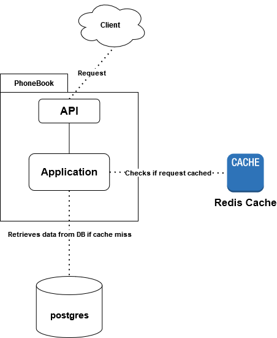
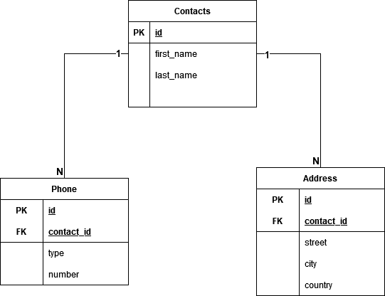

# Phonebook Application

The following application simulate phonebook as we know from our real life.
Each phonebook contains contacts and each contacts can have multiple phone numbers and addresses.

## prerequisites

* the application uses docker and docker-compose you need to have installed version of Docker.
* the following port must should be available: _5000 5432 6379_
    * **(optional)** in order to inspect redis with _redis insight_ you need to have the port _8001_ available too.
* it will help you to use **Postman** to create to requests but you can also use simple _curl_.

## System Design And Tech Stack

* The application compose of three different components:
    1. application layer - written in python flask using SQLAlchemy (ORM) - include API and application logic.
    2. persistent SQL database - using Postgres.
    3. key value LRU caching layer - using Redis.

### System Design

* each request that client sends arrives to the application API - the resource.
* the API pass each requests to application handlers
    * there are 2 handlers
        1. Cache handler - responsible for logic and to contact with cache repository in order to perform read/write
           operations.
        2. Contacts handler - responsible for logic and to contact with database repository in order to perform
           read/write operations read/write operations
* cached handler checks if the requests is cached and if so, return it.
* otherwise, request processed to the contact handler. the handler query's the DB in order to make response.
* cache handler save the new response in the cache with hashed key that consist of the type of the request. _(example
  for a key hash(http://localhost:5000/api/v1/contacts?page=1))_
* API create beautiful response and send it back to the client



### Data Design

* Each contact can have multiple phone numbers.
    * for example: mobile phone, home phone, etc...
* Each contact can have multiple addresses
    * for example: work, home, parents, etc...



## Endpoints

* **base URL for all the application:**
    * `http://localhost:5000/api/v1/`

### 1. Add Contacts -

* **Endpoint:** `POST /contacts`
* **Description**
    * The request creates a new Contact entity and returns the new entity with its ids
* **Error Handing**
    * 400 - request body is invalid.
    * 500 - any internal error like save in db fails.
* **Request Body**
    * **NOTE! All the fields are required**
    * each entity must have phones list and address list with one phone and address

```json
{
  "first_name": string,
  "last_name": string,
  "phone": [
    {
      "type": string,
      "number": string
    }
  ],
  "address": [
    {
      "street": string,
      "city": string,
      "country": string
    }
  ]
}
```

* **Response schema**:

```json
{
  "status": "success",
  "data": {
    "id": int,
    "first_name": string,
    "last_name": string,
    "phone": [
      {
        "number": string,
        "type": string,
        "id": int
      }
    ],
    "address": [
      {
        "country": string,
        "city": string,
        "street": string,
        "id": int
      }
    ]
  }
}
```

### 2. Retrieves all contacts with pagination

* **Endpoint:** `GET /contacts?page={page_number}`
* **Description**
    * The request retrieves all exists.
    * The response is pages of data with metadata about the result and the requested page data.
    * restrictions - page cannot be less than 1.
*
    * **Error Handing**
    * 400 - page number is less than 0.
    * 400 - page number is not numeric value
    * 500 - any internal error like save in db fails.
* **Query params**
    1. `page={int:page_number}` - required - number of the requested page.
* **Response schema**

```json
{
  "status": "success",
  "data": {
    "total_pages": 'int',
    "total_items": 'int',
    "next": 'int or null',
    "previous": 'int or null',
    "result": 'list of contacts in the current page that specify in the query params'
  }
}
```

### 3. Search for contacts by fist name with pagination

* **Endpoint:** `GET /contacts?page={int:page_number}&first_name={string:filter}`

* **Description**
    * The request retrieves all exists contact in a form of pages.
    * restrictions - page cannot be less than 1.
* **Query params**
    1. `page={int:page_number}` - required - number of the requested page.
    2. `first_name={string:filter}` - required - the name that you wish to find - can be the whole name or one or more
       letters of the name.
*
    * **Error Handing**
    * 400 - page number is less than 0.
    * 400 - page number is not numeric value
    * 500 - any internal error like save in db fails.
* **Response schema**
    * the response schema is similar to the GET ALL request but with the correspond data.

### 4. Update existing contact

* **Endpoint:** `PUT /contact/{int:contact_id}`
* **Description**
    * use this endpoint to update any exists contact details.
    * you can update phone and address details - if phone id or address is supplied it will update the exists one, else
      it will create a new one.
    * if contact not exists it will not create it.
* **URL Params**
    * `{int:contact_id}` - required
* **Error Handing**
    * 404 - contact not exists.
    * 400 - request body is invalid.
    * 500 - any internal error like save in db fails.
* **Request Body**
    * the requests body is similar to the POST requests
    * the main difference that you can add phone or address id to the request.

```json
{
  "first_name": string,
  "last_name": string,
  "phone": [
    {
      "type": string,
      "id": int,
      "number": string
    },
    {
      "type": string,
      "number": string
    }
  ],
  "address": [
    {
      "street": string,
      "city": string,
      "country": string,
      "id": int
    },
    {
      "street": string,
      "city": string,
      "country": string
    }
  ]
}
```

* **Response schema**
    * response consist of the data and its ids.
    * similar to POST request

### 5. Delete exists contact

* **Endpoint:** `DELETE /contact/{int:contact_id}`

* **Description**
    * delete contact with the related id from the url params
* **URL Params**
    * `{int:contact_id}` - required
* **Error Handing**
    * 404 - contact not exists.
    * 500 - any internal error like save in db fails.
* **Response schema**

```json
{
  "status": "success",
  "data": "Contact deleted!"
}
```

## Examples:

1. **Create contact**

* Request

```
http://localhost:5000/api/v1/contacts
```

* Request Body

```json
{
  "first_name": "Misty",
  "last_name": "Williams ",
  "phone": [
    {
      "type": "Mobile",
      "number": "0568487055"
    }
  ],
  "address": [
    {
      "street": "111 asaae",
      "city": "San Jose",
      "country": "USA"
    }
  ]
}
```

* Response

```json
{
  "id": 1,
  "first_name": "Misty",
  "last_name": "Williams ",
  "phone": [
    {
      "type": "Mobile",
      "number": "0568487055",
      "id": 1
    }
  ],
  "address": [
    {
      "street": "111 asaae",
      "city": "San Jose",
      "country": "USA",
      "id": 1
    }
  ]
}
```

2. **GET ALL**

* Request

```
http://localhost:5000/api/v1/contacts?page=1
```

* Response

```json
{
  "status": "success",
  "data": {
    "total_pages": 1,
    "total_items": 3,
    "next": null,
    "previous": null,
    "result": [
      {
        "id": 1,
        "first_name": "Misty",
        "last_name": "Williams ",
        "phone": [
          {
            "type": "Mobile",
            "number": "0568487055",
            "id": 1
          }
        ],
        "address": [
          {
            "street": "111 asaae",
            "city": "San Jose",
            "country": "USA",
            "id": 1
          }
        ]
      },
      {
        "id": 2,
        "first_name": "Rocky",
        "last_name": "Balboa",
        "phone": [
          {
            "number": "08189498",
            "type": "home",
            "id": 3
          },
          {
            "number": "0598476507",
            "type": "mobile",
            "id": 4
          }
        ],
        "address": [
          {
            "country": "Neverland",
            "city": "Gothem",
            "street": "112 Thomas",
            "id": 3
          }
        ]
      },
      {
        "id": 4,
        "first_name": "Ash",
        "last_name": "ketchum",
        "phone": [
          {
            "number": "123123",
            "type": "asdas",
            "id": 6
          }
        ],
        "address": [
          {
            "country": "Kanto",
            "city": "Pallet Town",
            "street": "111 Grass road",
            "id": 6
          }
        ]
      }
    ]
  }
}
```

3. **Search contacts**

* Request

```
http://localhost:5000/api/v1/contacts?page=1&first_name=m
```

* Response

```json
{
  "status": "success",
  "data": {
    "total_pages": 1,
    "total_items": 1,
    "next": null,
    "previous": null,
    "result": [
      {
        "id": 1,
        "first_name": "Misty",
        "last_name": "Williams ",
        "phone": [
          {
            "type": "Mobile",
            "number": "0568487055",
            "id": 1
          }
        ],
        "address": [
          {
            "street": "111 asaae",
            "city": "San Jose",
            "country": "USA",
            "id": 1
          }
        ]
      }
    ]
  }
}
```

4. **Update contact**

* Request

```
http://localhost:5000/api/v1/contact/1
```

* Request body

```json
{
  "id": 1,
  "first_name": "Misty",
  "last_name": "ketchum ",
  "phone": [
    {
      "type": "Mobile",
      "number": "0568487055",
      "id": 1
    }
  ],
  "address": [
    {
      "country": "Kanto",
      "city": "Pallet Town",
      "street": "111 Grass road",
      "id": 1
    }
  ]
}
```

* Response

```json
{
  "id": 1,
  "first_name": "Misty",
  "last_name": "ketchum ",
  "phone": [
    {
      "type": "Mobile",
      "number": "0568487055",
      "id": 1
    }
  ],
  "address": [
    {
      "country": "Kanto",
      "city": "Pallet Town",
      "street": "111 Grass road",
      "id": 1
    }
  ]
}
```

5. **Delete contact**

* Request

```
http://localhost:5000/api/v1/contact/1
```

* Response

```json
{
  "status": "success",
  "data": "Contact deleted!"
}
```
